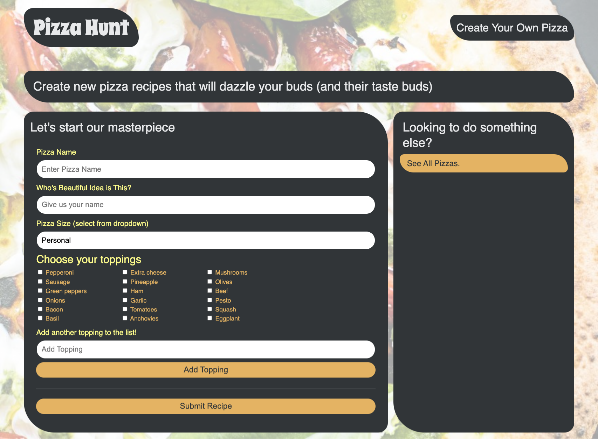
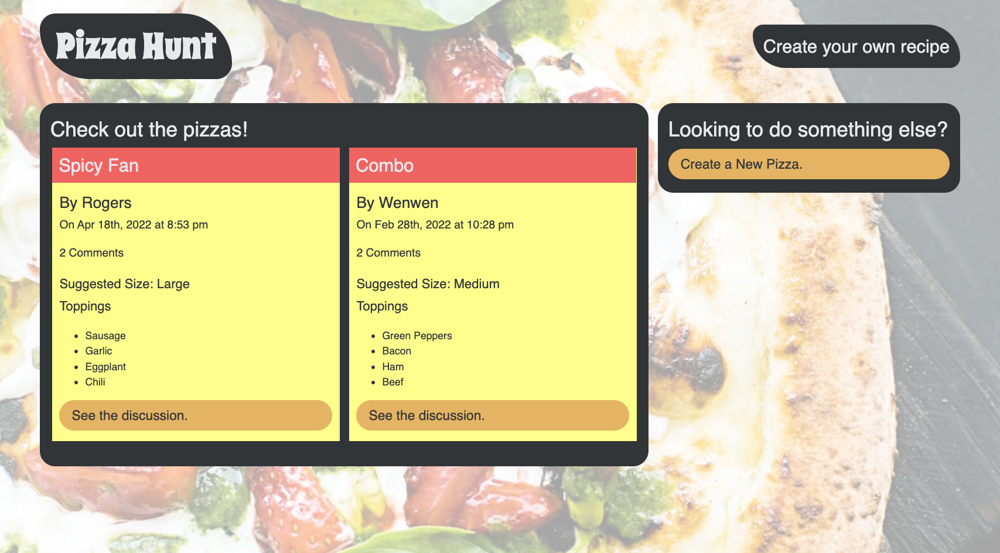
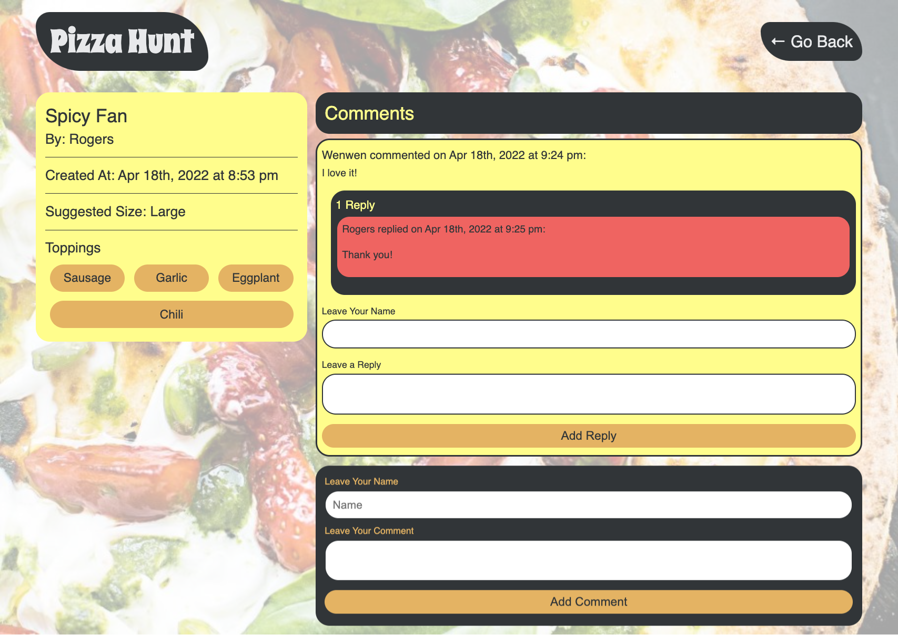

# Pizza Hunt

## Table of Contents

- [Description](#description)
- [Technology](#Technology)
- [Installation](#installation)
- [Usage](#usage)
- [License](#license)
- [Contribution](#contribution)
- [Questions](#questions)

## Description:

Pizza Hunt is a social media recipe app where users can post their creative spins on pizza, add comments to recipes, and create threads within comments. It's also a Progressive Web Application, which can save data locally when there’s no internet connection by using IndexedDB, a NoSQL client-side storage API in the browser.

## Technology:

Project is created with:

- Javascript
- Node.js
- Express.js
- MongoDB
- Mongoose.js
- IndexedDB
- HTML
- CSS

## Installation

To run this project, install it locally using npm:

```
npm install
```

## Usage

After installing npm packages, the application will be invoked by using the following command:

```
npm start
```

### Heroku Deployment

[Click me to see app!](https://pizza-hunt-20223.herokuapp.com/)

- Create heroku app

  ```
  heroku create
  ```

- Create database on MongoDB Atlas:

  ```
  Cluster ➡️ Collections ➡️ Create Database
  ```

- Change Heroku setting

  ```
  Config Vars ➡️ KEY: MONGODB_URI ➡️ VALUE: (from Cluster connect, change password and database name)
  ```

- Git push
  ```
  git push heroku main
  heroku open
  ```

### App Screenshot





## License

[](https://opensource.org/licenses/MIT) <br>
This project is licensed under MIT, for more information please visit [this website](https://opensource.org/licenses/MIT)

## Contribution

Made by Wenwen Tian

## Questions?

Please feel free to contact me if you need any further information:

- [Email](mailto:wwtian9@gmail.com)
- [Github Profile](https://github.com/joce1ynn)
